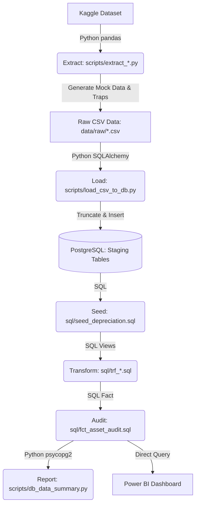
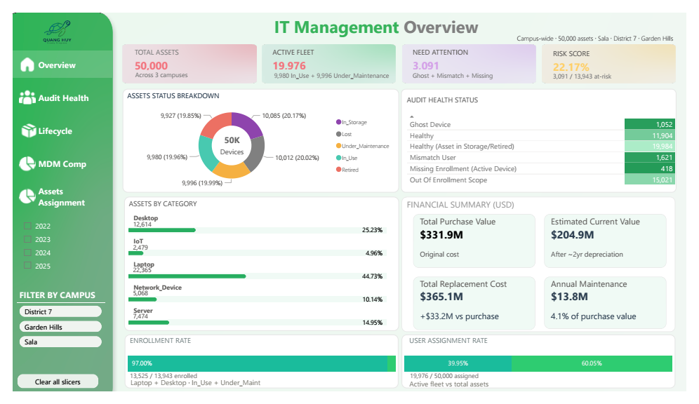
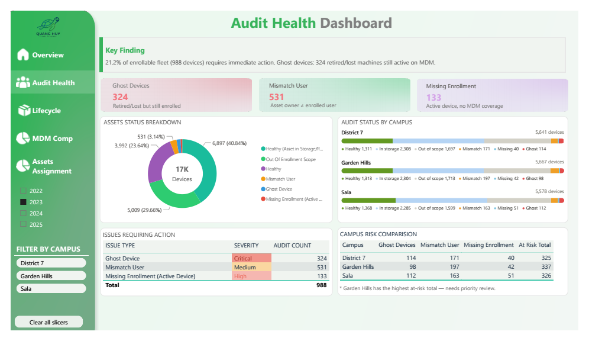
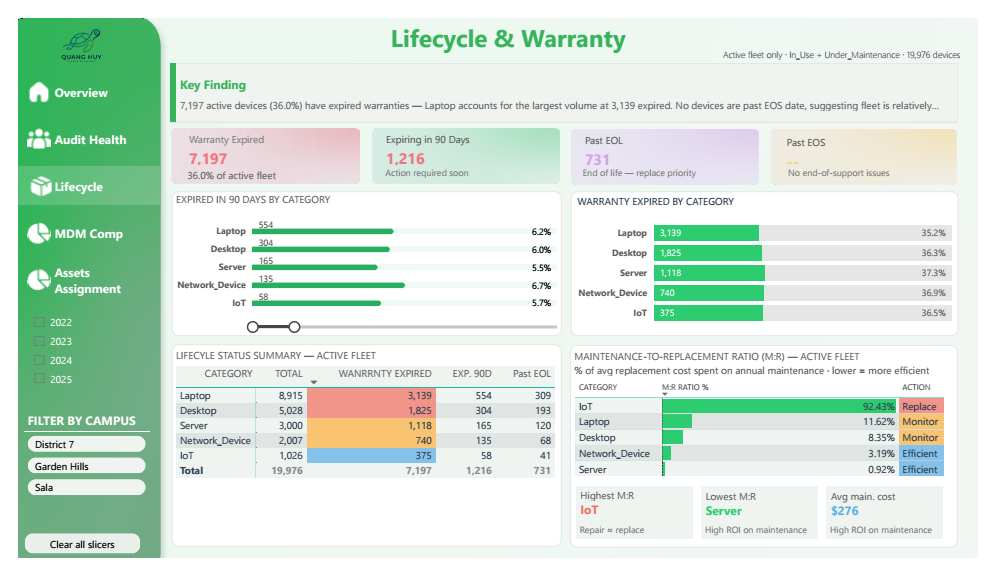
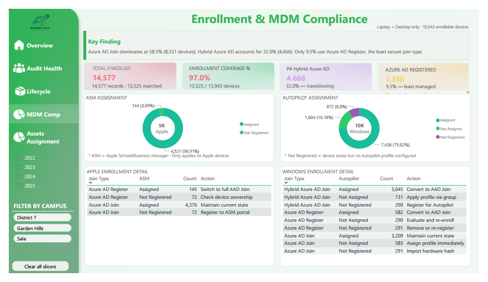
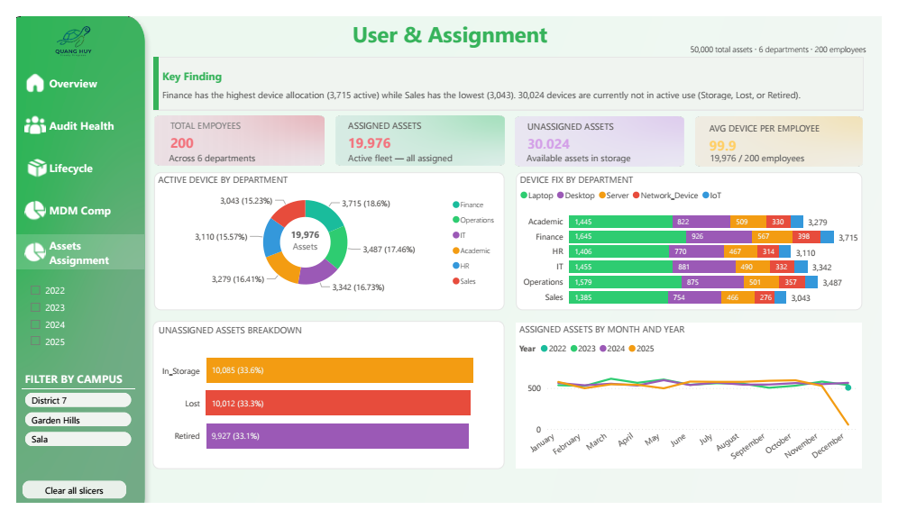

# 🏢 Modern Workspace Deployment Management - Data Pipeline

This project is a complete **Data Engineering Pipeline (ELT Architecture)** focused on simulating the management and reconciliation process of IT equipment (IT Assets) for corporate personnel. The system is fully automated, from fetching standard Kaggle data, generating intentional Data Traps, loading it into a PostgreSQL database, and applying business logic through a Data Warehouse (Kimball Model).

---

## 🏗️ Architecture & Tech Stack

- **Language:** Python (Pandas, SQLAlchemy, Psycopg2)
- **Database:** PostgreSQL 15 (Deployed on Docker)
- **Data Flow Architecture:** ELT (Extract - Load - Transform)
- **Visualization:** Power BI
- **Environment:** Docker, Virtual Environment

### 📊 Data Pipeline Architecture



---

## 🚀 Quick Start (Installation & Execution)

The pipeline is designed so that you only need to run **a single command** to activate the entire system (including the Docker Database). Please follow these 3 steps exactly:

### Step 1: Prerequisites

- Ensure **Python 3.9+** is installed on your machine.
- Ensure **Docker Desktop** is installed and running.

### Step 2: Environment Setup

The system uses a `.env` file to secure configuration information.

1. In the root directory, find the file named `.env.example`.
2. Rename (or copy) this file to **`.env`** (this is very important).
3. (Optional) To fetch real data from Kaggle, you need to provide your own `KAGGLE_TOKEN` in the `.env` file.
   *(How to get it: Go to Kaggle.com -> Settings -> Account -> Create New API Token -> Paste the secret string into KAGGLE_TOKEN).*

### Step 3: Run the Data Pipeline

Open your Terminal (Powershell/CMD) in the project directory and run the following commands:

```bash
# 1. Create and activate a virtual environment (if you haven't already)
python -m venv venv
.\venv\Scripts\activate      # For Windows
# source venv/bin/activate   # For Mac/Linux

# 2. Install required libraries
pip install -r requirement.txt

# 3. ACTIVATE THE SYSTEM (Only this single command is needed)
python main.py
```

🎉 **DONE!** The `main.py` script will execute the tasks sequentially:

1. **Infrastructure:** Automatically wake up Docker and set up the Postgres DB (`it_management`), pinging continuously until the DB is ready (Health Check).
2. **EXTRACT:** Randomly generate mock data (with intentional data traps) and save as `.csv` in `data/raw/`.
3. **LOAD:** Clean the DB and pump raw data into Staging Tables (`stg_*`).
4. **SEED:** Overwrite business rules (depreciation tables) onto raw data.
5. **TRANSFORM:** Execute SQL statements to clean data into Views (`trf_assets`, `trf_employees`) and aggregate the audit table (`fct_assets_audit`).
6. **REPORT:** Export a data summary report to the console.

---

## 🧩 Business Logic & Data Traps

To showcase real-world Data Engineering skills, intentional "Data Traps" (data quality issues) are injected during the extraction phase. These traps simulate common issues in corporate IT management:

| Trap Type                    | Ratio | Description                                                                   |
| ---------------------------- | ----- | ----------------------------------------------------------------------------- |
| **Missing Enrollment** | ~3%   | Device is In_Use/Under_Maintenance but has no MDM enrollment record.          |
| **Ghost Device**       | ~5%   | Device is Retired/In_Storage/Lost but still appears active in MDM.            |
| **Mismatch User**      | ~10%  | `Primary_User` != `Assigned_To_ID` (Unauthorized device swap).            |
| **Virtual Employee**   | ~2%   | `Primary_User` belongs to an employee ID that does not exist in HR records. |

The SQL views (`fct_asset_audit.sql`) use priority `CASE WHEN` statements to successfully identify and flag these issues.

---

## 📂 Directory Structure

```plaintext
DA_PORTFOLIO_PROJECT/
├── data/
│   ├── raw/                  # Auto-generated CSVs after Extract
│   └── processed/            # [Reserved] Processed data
├── scripts/                  # Python processing scripts
│   ├── extract_assets_to_csv.py      # Generate IT assets data
│   ├── extract_employees_to_csv.py   # Generate HR data
│   ├── extract_enroll_to_csv.py      # Generate enrollment data (with data traps)
│   ├── load_csv_to_db.py             # Load CSV to Staging Tables
│   └── db_data_summary.py            # Console summary report
├── notebooks/                # Exploratory Data Analysis (EDA)
│   ├── eda_data_quality.ipynb        # Interactive report (Charts & Insights)
│   └── eda_data_quality.py           # Script version (Automation & Git-friendly)
├── sql/                      # Data transformation logic (runs in DB)
│   ├── seed_depreciation.sql         # Seed: Device depreciation table
│   ├── trf_assets.sql                # Transform: Clean assets data
│   ├── trf_employees.sql             # Transform: Clean HR data
│   ├── trf_asset_cleaning.sql        # Transform: Additional cleaning rules
│   └── fct_asset_audit.sql           # Fact: Device reconciliation audit table
├── reports/                  # Power BI Dashboards (.pbix)
├── .env.example              # Environment configuration template
├── docker-compose.yaml       # Database Infrastructure (PostgreSQL 15)
├── requirement.txt           # Python Dependencies
├── main.py                   # 🏆 CENTRAL CONTROLLER (Orchestrator)
└── AGENTS.md                 # Rules & conventions for AI coding tools (Single Source of Truth)
```

---

## 📊 Dashboard Preview

The Power BI dashboard is designed following the **Pyramid Drill-down** architecture, moving from high-level executive summaries to granular technical details.

### 1. Executive Overview (General Health)

*High-level summary of the entire IT asset ecosystem.*


---

### 2. IT Audit & Compliance

**Focusing on reconciliation between Asset Management and MDM Enrollment (Data Traps detection).**


---

### 3. Asset Inventory & Lifecycle

*Detailed breakdown of asset categories, brands, and age distribution.*

---

### 4. Enrollment & MDM Compliance

*Detecting discrepancies between Asset Management and MDM Enrollment (Data Traps).*


---

### 5. User & Assignment

*Analysis of asset distribution across departments and users.*


---

## 📝 Notes for Developers

- All credentials are managed via `.env` — **NEVER** hardcode them in the source code.
- Data traps in `extract_enroll_to_csv.py` are created **intentionally** for analysis purposes — they are not bugs.
